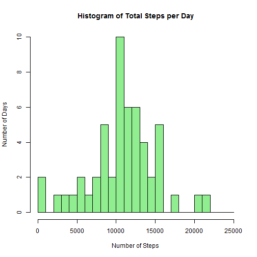
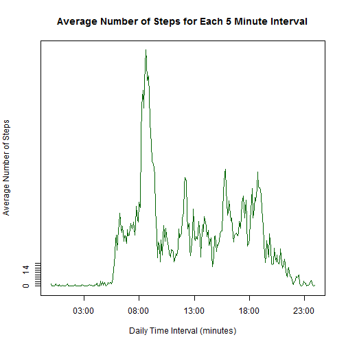
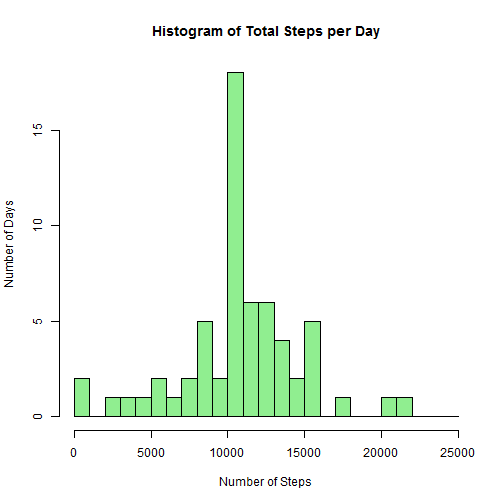
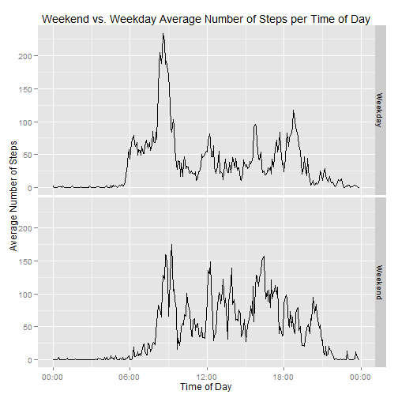

sp---
title: "Course Project 1"
author: "Will Hannon"
date: "Thursday, July 17, 2014"
output: html_document
---

**Loading and Processing Data**


```r
  df <- read.csv("activity.csv")
```

**What is the mean total number of steps taken per day**

For this part of the assignment, you can ignore the missing values in the dataset.


```r
  df1<-subset(df,!is.na(df$steps))
```

1. Make a histogram of the total number of steps taken each day


```r
  library(reshape2)
  df.m<-melt(df1,id=c("date"))
  df.d<-dcast(df.m,...~variable,sum)
  hist(as.numeric(df.d$steps),col = "lightgreen", breaks = seq(0,25000,by=1000), 
       main = "Histogram of Total Steps per Day", 
       xlab = "Number of Steps", ylab = "Number of Days")
```

 

2. Calculate and report the mean and median total number of steps taken per day


```r
  mean(df.d$steps)
```

```
## [1] 10766
```

```r
  median(df.d$steps)
```

```
## [1] 10765
```

**What is the average daily activity pattern?**

1. Make a time series plot (i.e. `type = "l"`) of the 5-minute interval (x-axis) and the average number of steps taken, averaged across all days (y-axis)


```r
  library(reshape2)
  df2<-as.data.frame(cbind(as.integer(df1$interval),as.numeric(df1$steps)))
  names(df2)=c("interval","meanSteps")
  df2.m<-melt(df2,id="interval")
  df2.d<-dcast(df2.m,...~variable,mean)
  df2.d$interval<-strptime(sprintf("%04d",df2.d$interval),"%H%M")
```

```r
  plot(x = df2.d$interval,y = df2.d$meanSteps, 
       type = "l", 
       yaxt= 'n', 
       xlab = "Daily Time Interval (minutes)", 
       ylab = "Average Number of Steps", 
       main = "Average Number of Steps for Each 5 Minute Interval", 
       col = "darkgreen")
  axis(2,at=seq(0,20,by=2))
```

 


2. Which 5-minute interval, on average across all the days in the dataset, contains the maximum number of steps?


```r
  format(df2.d$interval[which.max(df2.d$steps)],"%H:%M")
```

```
## character(0)
```

**Imputing missing values**

1. Calculate and report the total number of missing values in the dataset (i.e. the total number of rows with `NA`s)


```r
  length(df$steps[is.na(df$steps)])
```

```
## [1] 2304
```

2. Devise a strategy for filling in all of the missing values in the dataset. 


```r
  ## This method will substitute the daily mean for each interval if there is an `NA` value
  df2.d$interval<-format(df2.d$interval,"%H:%M")
  df$interval<-format(strptime(sprintf("%04d",df$interval),"%H%M"),"%H:%M")
  df.merge<-merge(df,df2.d,by="interval")
  
  df.merge.na<-subset(df.merge,is.na(df.merge$steps))
  df.merge.na<-cbind(as.numeric(df.merge.na$meanSteps),
                     as.character(df.merge.na$date),
                     as.character(df.merge.na$interval))
  df.merge.na<-as.data.frame(df.merge.na)
  names(df.merge.na)<-c("steps","date","interval")
  df.merge.na$steps<-as.numeric(as.character(df.merge.na$steps))
  df.merge.na$interval<-as.character(df.merge.na$interval)

  ## 'df1' contains all of the non-NA steps now and df.merge.na contains the mean substituted steps.
  all<-rbind(df.merge.na,df1)
```

3. Create a new dataset that is equal to the original dataset but with the missing data filled in.


```r
  ## This will correctly order by date to replicate the orignal dataset with `NA` values filled in.
  ord<-all[order(as.Date(all$date, format="%Y-%m-%d")),]
```

4. Make a histogram of the total number of steps taken each day and Calculate and report the mean and median total number of steps taken per day. Do these values differ from the estimates from the first part of the assignment? What is the impact of imputing missing data on the estimates of the total daily number of steps?


```r
  library(reshape2)
  df.m<-melt(ord,id=c("date","interval"))
  df.d<-dcast(df.m,date~variable,sum)
  hist(df.d$steps,col = "lightgreen", breaks = seq(0,25000,by=1000), 
       main = "Histogram of Total Steps per Day", 
       xlab = "Number of Steps", ylab = "Number of Days")
```

 

```r
  ## The mean of the dataset does not change:
  mean(df.d$steps)
```

```
## [1] 10766
```

```r
  ## The median of the dataset increases by 1, which is likely not a meaningful difference.
  median(df.d$steps)
```

```
## [1] 10766
```

**Are there differences in activity patterns between weekdays and weekends?**

1. Create a new factor variable in the dataset with two levels - "weekday" and "weekend" indicating whether a given date is a weekday or weekend day.


```r
  ## Use df1 data frame that has been stripped of `NA` values
  q4<-df1
  q4$date<-as.Date(q4$date, "%Y-%m-%d")
  q4$day <- as.factor(ifelse(weekdays(q4$date) %in% c("Saturday","Sunday"), "Weekend", "Weekday")) 
```

2. Make a panel plot containing a time series plot (i.e. type = "l") of the 5-minute interval (x-axis) and the average number of steps taken, averaged across all weekday days or weekend days (y-axis).


```r
  library(ggplot2)
  library(scales)
  q4$date<-NULL
  q4$interval<-as.character(q4$interval)
  df.m<-melt(q4,id=c("day","interval"))
  df.d<-dcast(df.m,...~variable,mean)
  df.d$interval<-strptime(sprintf("%04d",as.numeric(df.d$interval)),"%H%M")
  
  ggplot(df.d,aes(interval,steps)) + 
    geom_line()+facet_grid(day~.) + 
    scale_x_datetime(labels = date_format("%H:%M")) +
    ylab("Average Number of Steps") +
    xlab("Time of Day") +
    ggtitle("Weekend vs. Weekday Average Number of Steps per Time of Day")
```

 


